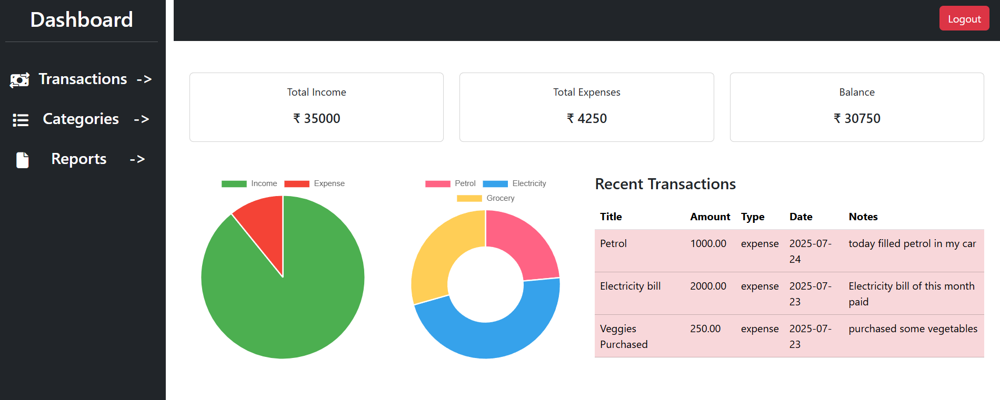
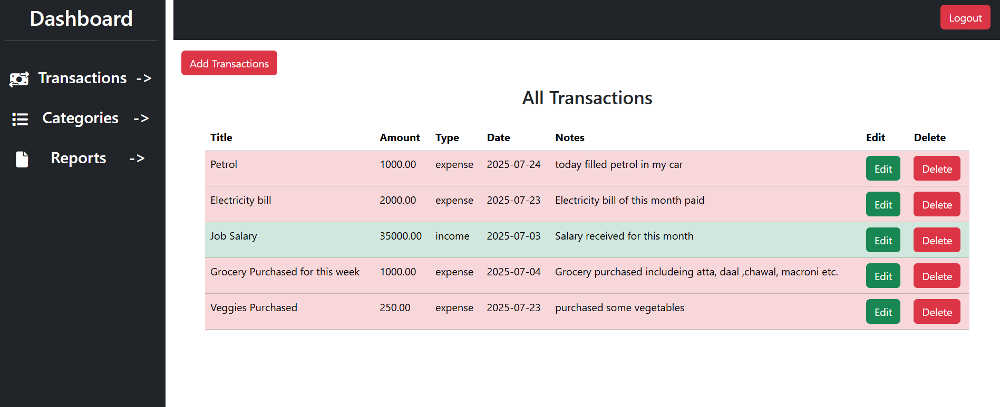

# 💰 Multi-User Finance Tracker (v1.0.0)

A clean and simple **personal finance management app** that supports multiple users. Track your income and expenses, categorize transactions, generate reports, and visualize your spending habits with charts.

---

## 🚀 Features

- 🔐 **Authentication**: Secure login and signup for each user
- 📊 **Dashboard**:
  - Real-time overview of total income, expenses, and balance
  - Dynamic charts for better insights
- 🧾 **Transactions Module**:
  - Add income and expenses with category selection
  - Color-coded entries:  
    ✅ **Green for income**  
    ❌ **Red for expenses**
  - Full CRUD support
- 🗂️ **Categories Module**:
  - Create custom income or expense categories
  - Full CRUD support
- 📅 **Report Tab**:
  - View transactions for a selected date range
  - Download reports in **PDF** or **Excel**
- 📈 **Charts**:
  - Income vs Expense comparison chart
  - Expense breakdown by category

---

## 🛠️ Tech Stack

- **Backend**: Laravel
- **Frontend**: Blade, Bootstrap
- **Database**: MySQL
- **Authentication**: Laravel Breeze / Auth scaffolding
- **Charts**: Chart.js or Google Charts
- **PDF Export**: DomPDF
- **Excel Export**: Laravel Excel

---

## 🖼️ Screenshots




---

## 📦 Getting Started

1. **Clone the repository**
   ```bash
   git clone https://github.com/yourusername/finance-tracker.git
   cd finance-tracker
   ```

2. **Install dependencies**
   ```bash
   composer install
   npm install && npm run dev
   ```

3. **Configure environment**
   ```bash
   cp .env.example .env
   php artisan key:generate
   ```

4. **Set up the database**
   - Update DB credentials in `.env`
   - Then run:
   ```bash
   php artisan migrate
   ```

5. **Serve the app**
   ```bash
   php artisan serve
   ```

---

## 📅 Future Roadmap

- 🔄 Recurring transactions
- ✉️ Monthly email summaries
- 💱 Currency support
- 🌙 Dark mode
- 📱 REST API for mobile apps

---

## 🧾 Version

**Current Version:** `v1.0.0`

---

## 📚 License

This project is licensed under the [MIT License](LICENSE).
